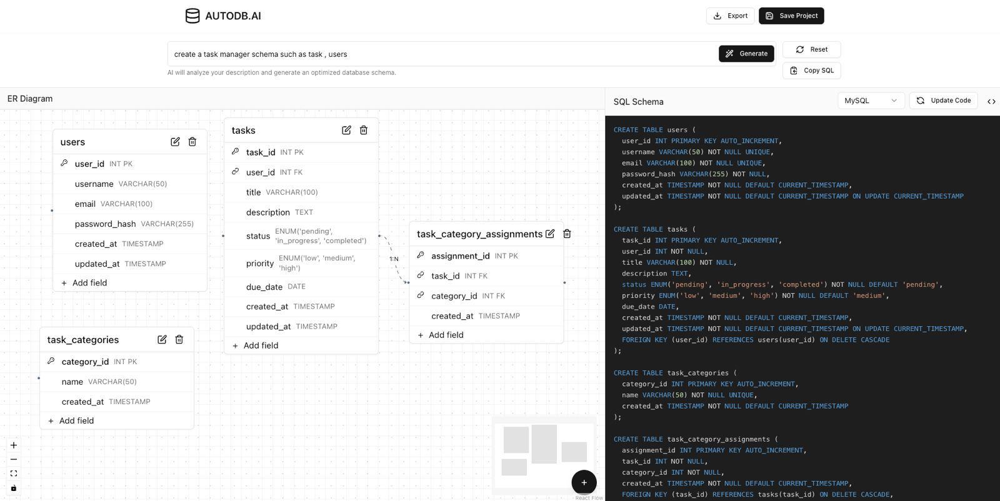
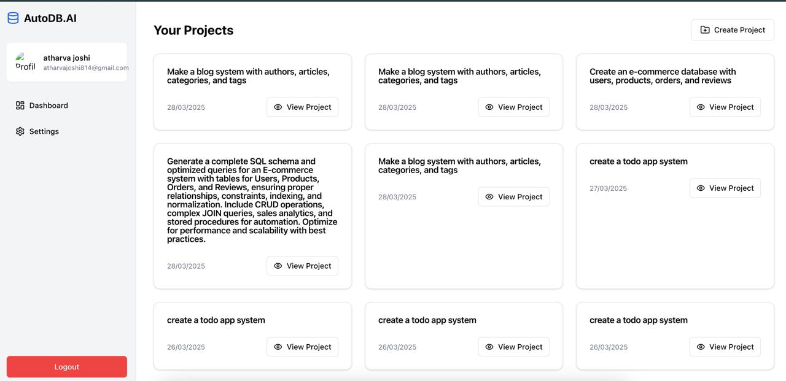
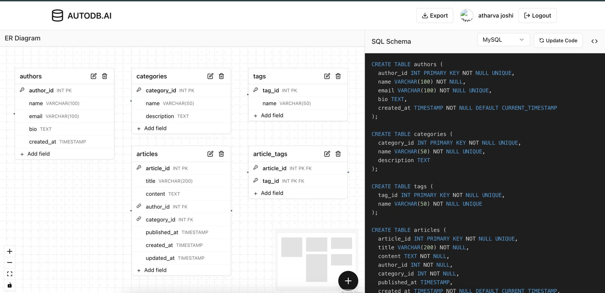

# AutoDB.AI - AI-Powered Database Generator


**🏆 Hack X ACM Hackathon Winning Project**

## 🚀 Problem Statement
Database design is a crucial part of software development, but manual schema creation is time-consuming, error-prone, and inefficient. Managing relationships, ensuring structural integrity, and making modifications demand tedious updates, slowing down innovation.

There is an urgent need for a **smarter, faster, and more intuitive solution** that automates database creation without requiring extensive technical expertise, enabling seamless and efficient software development.

---

## 💡 Solution: AutoDB.AI
**AutoDB.AI** is an AI-powered **Database Management System (DBMS) Generator** that transforms database design by enabling users to create an optimized database schema using a simple text prompt.

### ✨ Features
✅ **Automated Database Design**: Speeds up development by eliminating manual schema creation, benefiting startups, enterprises, and freelancers.

✅ **User-Friendly & Accessible**: Simplifies database structuring for data analysts and students, making learning and implementation effortless.

✅ **Real-Time Schema Updates**: Instantly syncs schema diagram changes with the SQL schema, ensuring accuracy and efficiency.

✅ **AI-Optimized Performance**: Generates structured, high-performance databases following industry best practices.

✅ **Future-Ready Enhancements**: Plans to support **NoSQL databases**, **AI-driven query optimization**, and **cloud integration** for scalability.

---

## 🛠️ Tech Stack
- **Frontend**: React.js (TypeScript)
- **Backend**: Node.js (TypeScript)
- **AI Model**: Claude Sonnet 3.7

---

## 🚀 Getting Started
### Prerequisites
Ensure you have **Node.js** installed.

### Installation & Running the Project
```bash
# Clone the repository
git clone https://github.com/your-repo/autodb-ai.git

# Navigate to the project folder
cd autodb-ai

# Install dependencies
npm install

# Start the development servers
npm run dev
```
After running the above command, **both the client and server will start automatically**.

🔗 Check the application on **`localhost:5003`**

---

## 📸 Screenshots
### AI-Generated Database Schema


### Dashboard


### View a Specific Project


---

## 🤝 Contributing
We welcome contributions! Follow these steps to contribute:

1. **Fork** the repository
2. **Create** a new branch (`git checkout -b feature-name`)
3. **Commit** your changes (`git commit -m 'Add new feature'`)
4. **Push** to your branch (`git push origin feature-name`)
5. **Create a Pull Request**

Feel free to open issues for **bug reports**, **feature requests**, or **enhancements**!

---

## ⭐ Show Your Support
If you find this project helpful, please **star** 🌟 the repository and **share** it with others!

Happy coding! 🚀
